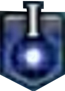
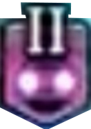
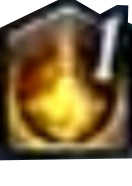
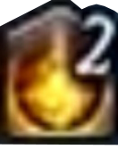
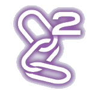
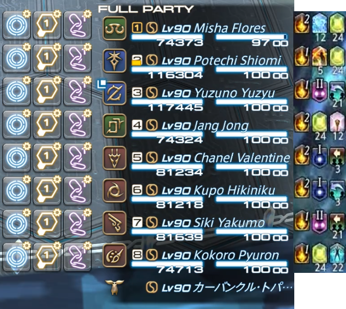

# 要件定義書: 絶オメガ検証戦 マーカークイズツール

## 1. 概要

### 1.1 目的

FF14の高難易度コンテンツ「絶オメガ検証戦」フェーズ5「コード：＊＊＊ミ＊【オメガ】」におけるマーカー割り当てギミックを、ゲーム外で繰り返し練習できるクイズ形式のWebツールを提供する。

### 1.2 対象ユーザー

- 絶オメガ検証戦の攻略を目指すFF14プレイヤー
- 特にマーカー担当者（コーラー）の練習用途を想定

### 1.3 技術スタック

- フロントエンド: TypeScript + Vite Plus
- ホスティング: 静的サイト（SPA）

---

## 2. 機能要件

### 2.1 パーティリスト表示

2つの方式を考えており、どちらを採用するかを検討している。

- FF14のパーティリストを再現する方式
  - FF14のパーティリストUIを模した8人分のプレイヤー一覧を表示する
  - 各プレイヤーにはジョブアイコン・レベル・名前・HPバーを表示する
  - パーティ構成（ジョブ・名前）はプリセットまたはランダムまたは手動で生成する
- 既にある画像を使用してパーティリストとする方式
  - images/PartyList.png をそのままパーティリストとして表示する
  - 拡大縮小をした際に、ボタンやバフデバフの位置がパーティメンバーからずれないように考慮する

### 2.2 デバフ・バフの表示

以下のステータスアイコンをパーティメンバーにランダムに、表示する:

| アイコン                              | 名称                                 | 説明                            |
| ------------------------------------- | ------------------------------------ | ------------------------------- |
|  | ハローワールド：ファーストターゲット | 青色フラスコ（I）               |
|  | ハローワールド：セカンドターゲット   | 紫色フラスコ（II）              |
|  | デュナミス1                          | 金色の炎アイコン（スタック数1） |
|  | デュナミス2                          | 金色の炎アイコン（スタック数2） |

表示方法は、パーティリストの各メンバーの右側とする。また、順序は必ず `デュナミス` -> `ハローワールド` となる

### 2.3 マーカー割り当てクイズ

出題時にデバフ・バフの組み合わせをランダムに生成し、ユーザーが各プレイヤーに正しいマーカーを割り当てる
マーカーボタンはパーティリストの各メンバーの左側に `サークルマーカー`, `攻撃マーカー`, `鎖マーカー` の順で表示する
また、後述する割り当てルールに従うため、 `攻撃マーカー` および `鎖マーカー` についてはどのメンバーにおいてもすべて 1 を表示する

#### 割り当て可能なマーカー:

ボタンとして表示するマーカーは下記の通り。

| アイコン                              | 名称             |
| ------------------------------------- | ---------------- |
|    | サークルマーカー |
|      | 鎖マーカー1      |
|      | 鎖マーカー2      |
|  | 攻撃マーカー1    |
|  | 攻撃マーカー2    |
|  | 攻撃マーカー3    |
|  | 攻撃マーカー4    |

#### 割り当てルールについて

- あるメンバーのマーカーボタンをクリックすると、そのメンバーにマーカーを付与し、マーカーボタンを空にする
- ただしサークルマーカーについては、そのメンバーについてマーキングしないことを意味するため、メンバーにマーカーを付与することなくマーカーボタンを空にする
- マーカーボタンのうち、 `鎖マーカー` と `攻撃マーカー` については、押した順番に 1, 2, 3, 4 と番号が順番についていく
  - たとえば、パーティリストが Aさん, Bさん, Cさん と並んでいるとき、Bさんの攻撃マーカー, Cさんの攻撃マーカー, Aさんの攻撃マーカーとクリックした場合、 Bさんには攻撃マーカー1が, Cさんに攻撃マーカー2が, Aさんに攻撃マーカー3 が付与される
  - そのため、マーカーボタンでは全メンバーに対して `鎖マーカー1` と `攻撃マーカー1` を表示する
- 1人に複数のマーカーを付与することはできない

### 2.4 正誤判定・フィードバック

- ユーザーが全パーティメンバーに対してマーカーを割り当て完了後、正解と比較して正誤を表示する
- 正解の場合は正解であることを表示する
- 不正解の場合は、全パーティメンバーについて本来付与すべきだったマーカーを表示する

正誤判定については、下記の順序で確認を実施する。

- 0: `ハローワールド：ファーストターゲット` のメンバー2人の `サークルマーカー` をクリックする
- 1: 下記のルールに従い、 `鎖マーカー` を2人に付与する(2人に付与した時点で、 `鎖マーカー` の付与は即終了する)
  - 1.1: `ハローワールド：セカンドターゲット` かつ、 `デュナミス2` のメンバーがいれば、そのメンバーに最優先で `鎖マーカー` を付与する
  - 1.2: `デュナミス2` のメンバーに `鎖マーカー` を付与する
  - 1.3: `デュナミス1` のメンバーに `鎖マーカー` を付与する
- 2: 下記のルールに従い、 `攻撃マーカー` を4人に付与する(4人に付与した時点で、 `攻撃マーカー` の付与は即終了する)
  - 2.1: `デュナミス2` のメンバーに `攻撃マーカー` を付与する
  - 2.2: `デュナミス1` のメンバーに `攻撃マーカー` を付与する
- ルールの補足
  - 0番の `サークルマーカー` の付与については、正誤の判定に含めない
  - 1.1, 1.2, 1.3 と 2.1, 2.2 については、記載順に優先度が高いことを意味しており、これについて厳密に判定すること
  - ただし、同じ優先度同士については、マーカー付与順が前後しても正解とする
    - パーティリストの並びを見て、同じ優先度の人を上から付与しても下から付与しても正解とする

### 2.5 出題のランダム生成

- デバフ・バフの割り当てパターンをゲーム内の実際のルールに基づいてランダム生成する
- ルールは下記の通り
  - `デュナミス1` を、ランダムに4人に付与する
  - `デュナミス2` を、デュナミス1を持っていない4人に付与する
  - `ハローワールド：ファーストターゲット` を、ランダムに2人に付与する
  - `ハローワールド：セカンドターゲット` を、`ハローワールド：ファーストターゲット` を持っていない人の中からランダムに2人に付与する

---

## 3. 非機能要件

### 3.1 レスポンシブ対応

- PC・タブレット・スマートフォンで操作可能なレイアウトとする

### 3.2 オフライン動作

- 静的サイトとしてデプロイし、サーバーサイド処理を必要としない
- 全ロジック・アセットをクライアント側で完結させる

### 3.3 パフォーマンス

- 出題生成・正誤判定は即座に完了すること（体感遅延なし）

---

## 4. UI設計参考

### 4.1 マーカーボタン、バフデバフ付きパーティリスト

FF14のパーティリストに準じたデザインを目指す。
各メンバー行について、左側に `サークルマーカー`, `攻撃マーカー`, `鎖マーカー` のボタンを表示し、右側に `デュナミス`, `ハローワールド` のバフデバフを表示する。

---

## 5. 用語集

| 用語           | 説明                                                       |
| -------------- | ---------------------------------------------------------- |
| 絶オメガ検証戦 | FF14の高難易度8人コンテンツ（The Omega Protocol Ultimate） |
| マーカー       | プレイヤーの頭上に表示される目印。散開位置の指示に使われる |
| デバフ         | プレイヤーに付与される状態異常アイコン                     |
| デュナミス     | 絶オメガ固有のバフ。スタック数によって処理が変わる         |
| ハローワールド | 絶オメガの当該フェーズで登場する一部ギミックの名称         |
| コーラー       | パーティ内でマーカー割り当てを担当するプレイヤー           |
